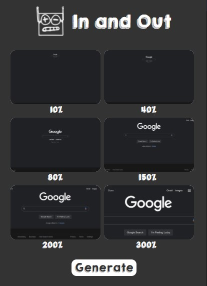
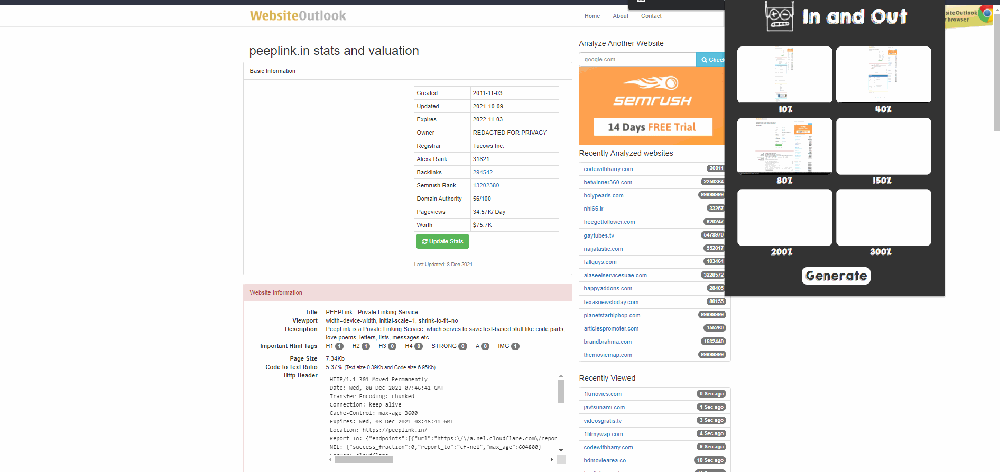

# In & Out
***(a hackathon project)***

In & Out is small chrome extension meant to help developers quickly check if their webpage is responsive.
With a click of a button, In & Out will generate 6 screen shots of your web app in 6 different zoom levels.

Unfortunately, taking screen shots through Chrome's extension API meant that there will be some delay. Chrome's API only allow users to manually programatically zoom in, take a screen shot and so on. It takes the extension around 2-3 seconds to take 6 screenshots, which is the best we can do with the limitations given.
